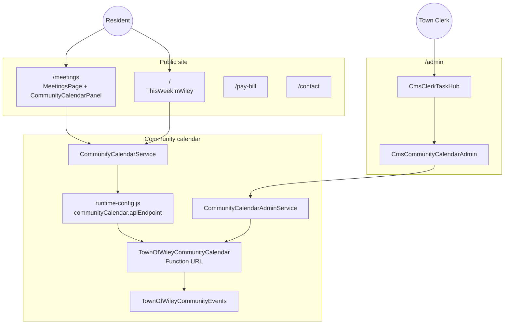
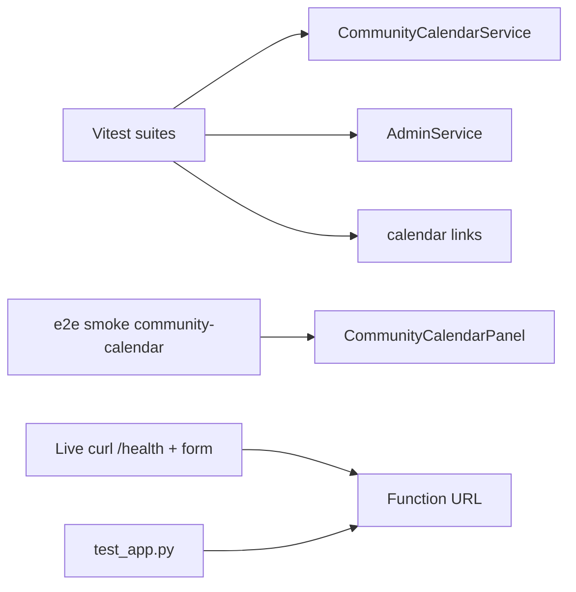

# Town of Wiley — Function Tree

**Auto-generated raw data:** [function-inventory.generated.md](./function-inventory.generated.md)
**Status overlay:** [action-items.md](./action-items.md)



## Community calendar proof map



## How to refresh

```bash
npm run inventory
```

See [action-items.md](./action-items.md) for verification evidence and backlog.
