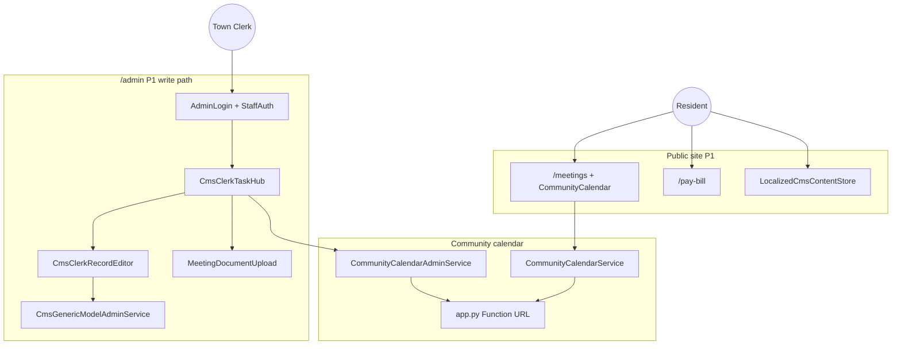

# Town of Wiley — Function Tree

**Auto-generated surfaces:** [function-inventory.generated.md](./function-inventory.generated.md)
**Status overlay:** [action-items.md](./action-items.md)
**Per-surface passes:** [correctness-surface-passes.md](./correctness-surface-passes.md)
**Allowlist:** [`.function-inventory.json`](../.function-inventory.json) (`tracking_mode: surfaces`)



## How to refresh

```bash
npm run inventory
```

See [action-items.md](./action-items.md) for P1 verification evidence.
